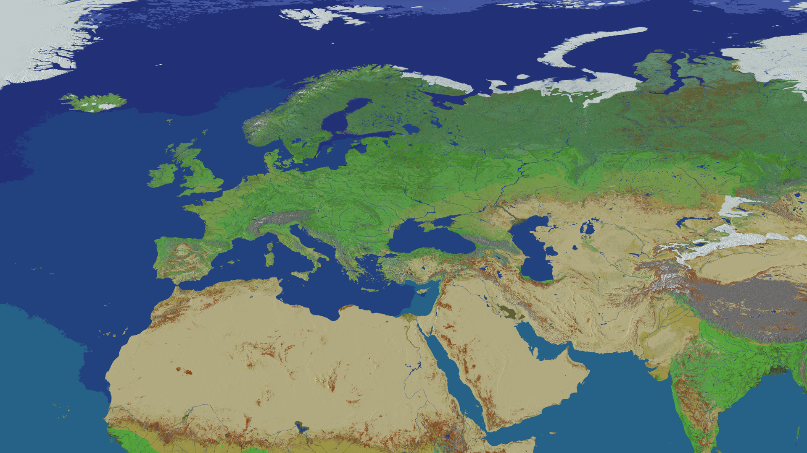

# Getting Started

Welcome to EarthCube! This guide will help you get started on our server and understand the basics of playing on our 1:750 scale Earth map.

### First Steps

- **Connect to the server**  
  Use the server address: `play.earthcubemc.net`
  For Bedrock Edition, use the same address with port: `19132`

- **Spawn in the world**  
  You'll spawn in the spawn area. There you'll find some information, scoreboards and the AdminShop.

- **Use the world map**  
  Type `/map` to access our [interactive web map](/docs/map), which shows towns, nations, and your current position in the Earth.

- **Travel to a location**  
  Use `/warp [continent]` to teleport to a continent your choice. For example, `/warp Europe` will teleport you to Europe.  
  You could also run `/earth` to teleport in a random location in the Earth.

- **Join a town or create your own**  
  You can join an existing town (use `/t list` to see a list) or create your own with `/town create [name]` (costs 128 gold).  
  To find a town you could also join the [Discord server](https://discord.earthcubemc.net), where you can ask for a town.

- **Get your first gold**  
  You can execute `/vote` to open the voting sites and vote for the server. You will get a crate which, when opened, gives free gold and rewards!

### Understanding Scale

Our Earth map is scaled at 1:750, meaning:
- 1 block = 750 meters in the real world
- Travel is much faster than in real life
- Continents are accurately shaped but compressed