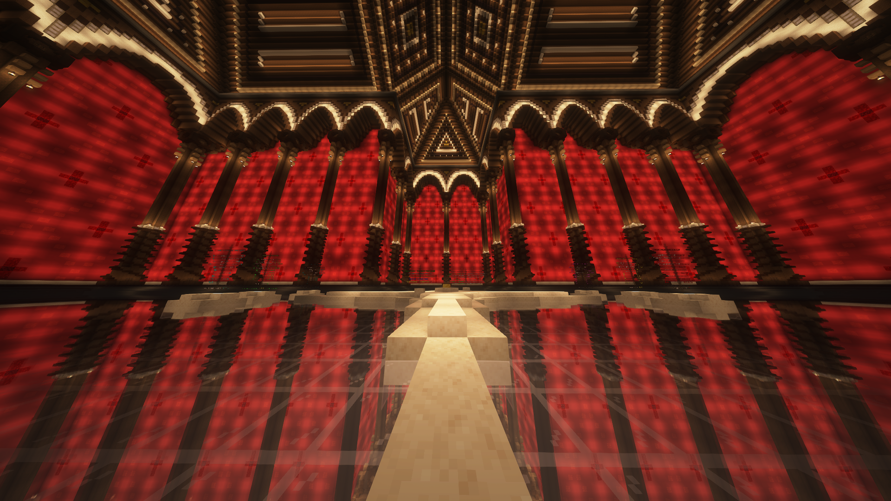

The IP is **play.earthcubemc.net** and the port is **19132** if you're on Bedrock.

You can join from Java, Bedrock and console (still bedrock) editions!
We don't support any PC cracked clients, so you will have to buy a real copy of Minecraft [here.](https://www.minecraft.net)

### To join on Java:
- Start Minecraft Java
- Click "Multiplayer"
- Click "Add Server"
- Change "Server Name" to EarthCube
- Enter the IP **play.earthcubemc.net**
- Click "Done" and you're in! No need for ports!

### To join on Bedrock:
- Start Minecraft Bedrock
- Click "Multiplayer"
- Click "Add Server"
- Change "Server Name" to EarthCube
- Enter the IP **play.earthcubemc.net**
- Enter the port **19132**
- Click "Done" and you're in!

### To join on console versions:
- Start Minecraft
- Click "Friends"
- Click "Add Friend" and add **PlayEarthCube**
- You can join the server through the friend!

### Discord Linking 
After joining the server, you might want to link your Discord account too!

To do so, you first need to join our [Discord server](https://discord.earthcubemc.net).
Then:
- Execute `/discord link` in game
- Copy the code sent to you by clicking on the messag
- Paste the code in the PM with our Discord bot.
- You are now linked!

Linking gives you the Player role in the Discord server.