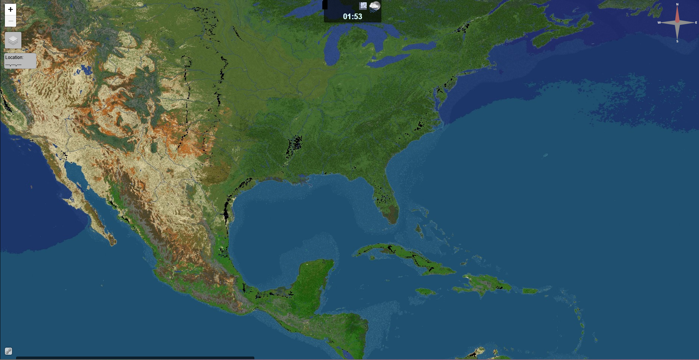

After you enter the server and teleport to a continent, you may want to see your specifical position in the world.
You can do that! You just need to run `/map` in chat while in the server.
Alternatively you could search `map.earthcubemc.net` on the Internet.

The map shows:
- The position of all players online in the world
- The position of all towns and nations in the world
- Changes made to the terrain

The map updates once in a while. Also, players sneaking or using invisibility potions are hidden from the map.

:::info
If you see black tiles on the map, it's because DynMap failed to load that chunk first try - once players start playing and updating the map in that area, the black tiles should disappear and the map should totally load!
:::