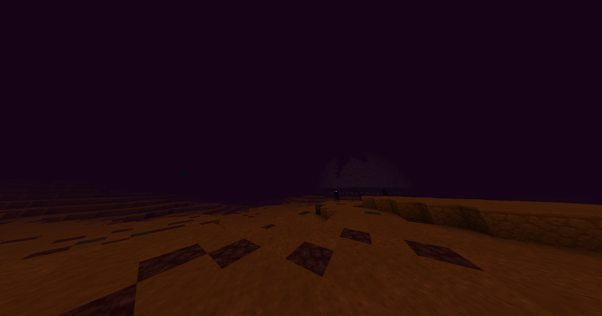

EarthCube is the first server of its kind to feature new planetary worlds other than the Earth! From V3, the server has 2 new worlds, the Moon and Mars.

:::caution
The planets addition is still in open beta, and we don't know if there could be unexpected planets world resets. You may want not to leave anything on them. Please report to our staff team everything that doesn't seem normal to you. Thank you and sorry in advance for the problems caused.
:::

### How to Access

A prerequisite is to have 2.000 gold in your personal bank account, as they will be withdrawed from your account when executing the command to obtain the Space Rocket. You can deposit gold in your account with `/sell hand`.

1. Execute the `/rocket` command to obtain the Space Rocket, 2.000 gold will be cancelled from your account after doing this!
2. Hold the Space Rocket in hand and right-click it
3. You should see a planet selection UI. Select the planet you want to land on
4. You will be RTPed to the selected world!

You can also teleport in group with some friends! With one rocket only, you can use it in the same chunk with up to 3 people and the others will get prompted to run the command `/pl accept` in chat to teleport with you to the planet. You have 20 seconds to run the command, or else the request will expire.

:::tip
If you're stuck on a planet, you can either call a friend to help you (using the group teleport feature) or buy another Space Rocket with `/rocket`. This last option only works if you have 2.000 gold in your bank account! Staff won't help you if you find yourself in this situation.
:::

### The Worlds

We used Perlin noise, the same method that Minecraft uses for making its worlds, for creating the planets. Mars has a dramatic landscape, while the Moon is quite flat with larger craters. There is no gold on planets, though ore and cave generation exists.

Mars is an alternative to the Nether, that doesn't work normally in the server. In fact, it is much more difficult to survive than on the Earth, because it has the Nether entities, though it has more resources and Netherite ores when mining close to Y40 - Y0 (bedrock).

On the Moon it is easier to survive, but still pretty hard as mobs don't despawn (it's always night). It isn't a real alternative to the End because there is no Ender Dragon. It doesn't have the same resources as Mars. Ore generation is different.

Planets have a square world border with radius 8000 blocks, so 16000 blocks in diameter. This because we don't want the server to be overloaded with too many chunks, that may also disrupt the Earth world experience.

:::caution
Players with low-end PCs or console specs may experience lag in the planets, especially in Mars.
:::

The planets also have custom generated (make by our admin Aemadeous) structures that are spawned later after the normal generation. When a player reaches an unexplorated area, it may spawn these structures. You can see an example of a Mars structure in the image above. New structures may be added in the future.

:::tip
Structures may have loot inside of them. You may want to explore more to find them as they're really rare, there aren't many now!
:::

### Good to Know

The Space Rocket has 30 uses, you may want to use these appropriately as when the uses finish, you have to buy another rocket with the same command. Note that with 30 uses you have only 15 returns to the Earth. To check your uses, you can see the Space Rocket's lore in your inventory.

Also, before teleporting on a planet, make sure you have appropriate gear and combat items, as them will help you a lot. Especially, since there is no trees in planets, you may want to take with you some wood to craft utility items when those run out.

There is no DynMap on planets, so you won't know your surroundings. Though, you can see your coordinates with `F3` and make a friend come at your location. There is no spawn point on planets as you're teleported randomly (in a safe location).